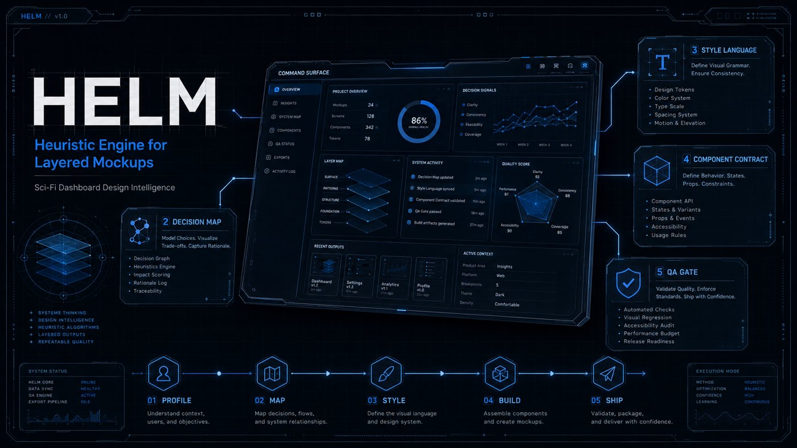
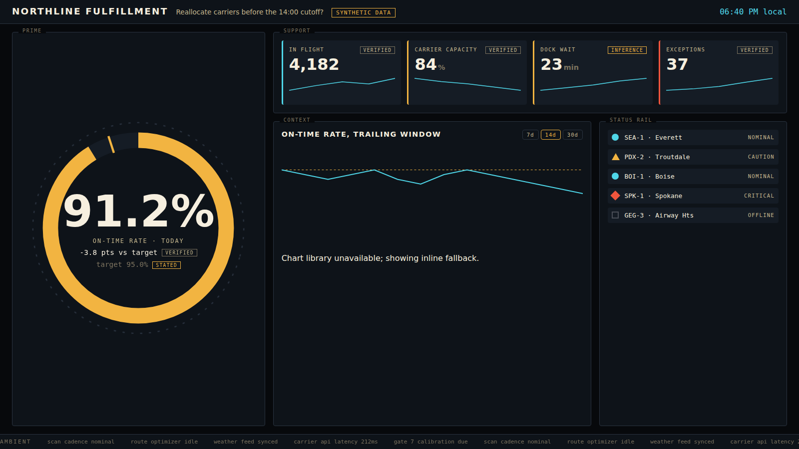

# BHIL-HELM



**Heuristic Engine for Layered Mockups.** Turn client data into eye-catching, functional, Claude Code friendly interactive dashboards styled in science-fiction design languages. Evidence-tiered. IP-clean. Regenerable.


[](LICENSE) [](LICENSE-CONTENT)

Read [ABOUT.md](ABOUT.md) for the full story of the framework, or open the [visual reference pack](research/reference-pack/README.md) that the catalog was distilled from.

Fictional user interfaces are the most effective communication design under time compression ever produced: a film screen has one second to read as complex and clear. HELM keeps that discipline and strips the tropes that make screen UIs anti-usable in real products. The result is a dashboard that serves a decision, looks like a command surface, and can be rebuilt by the client's own Claude Code without the lab in the loop.



*The starter build. Tactical HUD language, wall-display density, SYNTHETIC badge, evidence labels on the STATED target and the INFERENCE metric, shape-coded status rail, decorative ambient stream. Rendered without the CDN to show the inline fallback.*

## What is in the box

| | |
|---|---|
| **Ten-prompt system** | `prompts/` Master prompt plus SP-1 (profile) through SP-10 (gate) |
| **15 design languages** | `data/canonical/catalog.json` Command-Console, Tactical HUD, Industrial Terminal, Vector-Wireframe, Gestural Holographic, Hard-Realism Tactical, NASA-Utilitarian, Sonar-Surveillance, Neuro-Medical, Corporate-Liner, Tabletop-Motion, Neon-Grid, Monochrome-Blueprint, Diegetic Wearable, Retro-Forward |
| **Generated token sets** | `tokens/*.css` One CSS custom-property file per language, drift-gated |
| **Claude Code scaffold** | `.claude/` CADRE pattern: four tool-restricted subagents, six slash commands, one skill |
| **Starter build** | `examples/helm-starter/` A working Tactical HUD dashboard on labeled SYNTHETIC data with its own client scaffold |
| **Templates** | `templates/` What every client build inherits |
| **Validators** | `tools/` Stdlib-only: schema, count laws, cross-refs, contrast floors, register, drift, em-dash sweep |
| **Docs site** | `docs/` MkDocs Material, strict build, deployed to Pages |

## Quick start

```bash
git clone https://github.com/PolymathWizard/BHIL-HELM-Sci-Fi-Visualizer
cd BHIL-HELM-Sci-Fi-Visualizer
python3 tools/validate.py                      # PASS: 15 languages, 12 tropes, 5 tiers, 11 rules, 14 components
python3 tools/contrast.py tactical-hud         # WCAG matrix for one language
open examples/helm-starter/dashboard.html      # no build step, no server
```

Then in Claude Code at the repo root:

```
/helm brief
```

The skill confirms six intake values, creates `engagements/<REF>/`, and runs profiler, stylist, builder, and QA in order, asking after each stage whether to continue or refine.

## How it works

```
DATA ──► SP-1 Data Register ──► SP-2 Decision Map ──► SP-3 Language + Narrative Tax
                                                              │
                              SP-4 Zones ──► SP-5 Components ──► SP-6 Artifact + scaffold
                                                                        │
                                                    SP-7 Motion ──► SP-8 QA ──► SP-10 SHIP / HOLD / REWORK
```

Profile before styling. One language per screen. Every number carries an evidence class (VERIFIED / CORROBORATED / UNCORROBORATED / INFERENCE / STATED) and the lower three render their label on screen. Ambient content is marked decorative. The builder never gates its own output.

## The catalog in one table

| Data shape | First fit | Alternate |
|---|---|---|
| Status grid, calm monitoring | Command-Console | NASA-Utilitarian |
| Telemetry, few critical numbers | Tactical HUD | Hard-Realism Tactical |
| Logs, audit trails | Industrial Terminal | Sonar-Surveillance |
| Investigation, drill-down | Gestural Holographic | Neuro-Medical |
| Security, anomaly, network | Sonar-Surveillance | Industrial Terminal |
| Multi-unit operations | Hard-Realism Tactical | Command-Console |
| Clinical, regulated, precision | Neuro-Medical | NASA-Utilitarian |
| Public-facing, wayfinding | Corporate-Liner | Command-Console |
| Long time-series, archival | Vector-Wireframe | Industrial Terminal |
| Evidence boards, deal rooms | Tabletop-Motion | Gestural Holographic |
| Entertainment, nightlife | Neon-Grid | Corporate-Liner |

Full lineage cards, tokens, and motion grammar: [docs/catalog](docs/catalog/index.md).

## What HELM refuses to do

1. **Reproduce a protected work.** Lineage is a study reference. No franchise name, logo, glyph system, licensed font, or copied frame enters a deliverable. The test suite enforces it.
2. **Fabricate data to fill a zone.** Empty is honest. Synthetic is labeled. Ambient is decorative.
3. **Ship a dashboard the client cannot regenerate.** Every build carries `CLAUDE.md`, a skill, and `REGENERATE.md`.

## Commercial tiers

Snapshot (one screen, two-page readout, the door-opener) · Core Build (full brief, artifact, scaffold, QA) · Enterprise (multi-screen, multi-language token sets, design-system handoff) · Retainer (rebind, restyle, add-panel cycles). Details in [docs/guide/commercial.md](docs/guide/commercial.md).

## Repository layout

```
BHIL-HELM-Sci-Fi-Visualizer/
├── CLAUDE.md                   standing brief for any Claude Code session
├── prompts/                    00-master + sp-01 .. sp-10
├── data/canonical/             catalog, tropes, evidence tiers, matching, components, lineage register
├── data/schemas/               JSON Schema 2020-12 with count laws
├── tokens/                     generated CSS token sets (15)
├── templates/                  artifact, CLAUDE.md, REGENERATE.md, client SKILL.md
├── examples/helm-starter/      complete starter build
├── assets/hero/                launch imagery (BHIL originals, full resolution)
├── research/reference-pack/    study board: 43 sourced visuals, coverage ledger, catalog PDF/HTML
├── .claude/                    agents, commands, skills, settings
├── tools/                      validators and builders (stdlib only)
├── tests/                      regression tests naming specific bugs
├── docs/                       MkDocs site (derived pages generated)
├── launch/                     GitHub description options and LinkedIn posts
├── ABOUT.md                    what HELM is, why, and how it runs
├── DISCLAIMER.md               third-party material, intended use, no warranty
└── engagements/                gitignored client work (.gitkeep only)
```

## Disclaimer

All film, television, and game titles, studio and designer names, and the study images in `research/reference-pack/` are the property of their respective license holders and appear here for design study and lineage attribution only. This repository is solely for development, research, and innovation use. See [DISCLAIMER.md](DISCLAIMER.md).

## Conventions

Canonical JSON generates every derived artifact; CI fails on drift. Dual licensed: MIT for code, schemas, and tokens; CC BY 4.0 for prose. Conventional commits scoped `helm:`. No em dashes in shipped prose. See [CONTRIBUTING.md](CONTRIBUTING.md).

## Related BHIL frameworks

CODEX (agent scaffolding, upstream) · CDPA (data architecture, downstream) · QUADRA, CADRE, FACET, LOCUS (the BHIL framework family) · [BHIL-AI-First-Development-Toolkit](https://github.com/PolymathWizard/BHIL-AI-First-Development-Toolkit)

---

*HELM. Barry Hurd Intelligence Lab. Human-Directed. AI-Enabled. Commercially Tested.*
