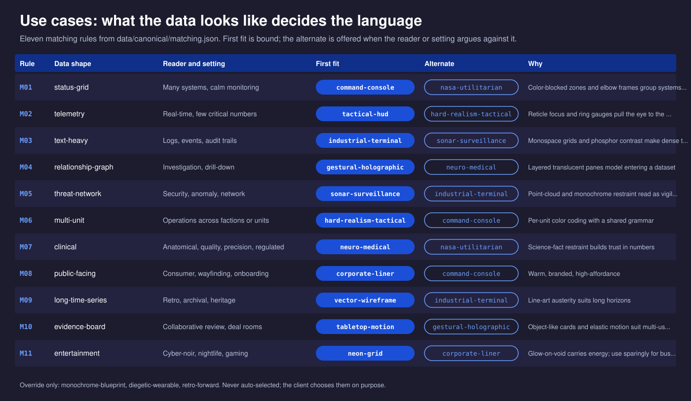
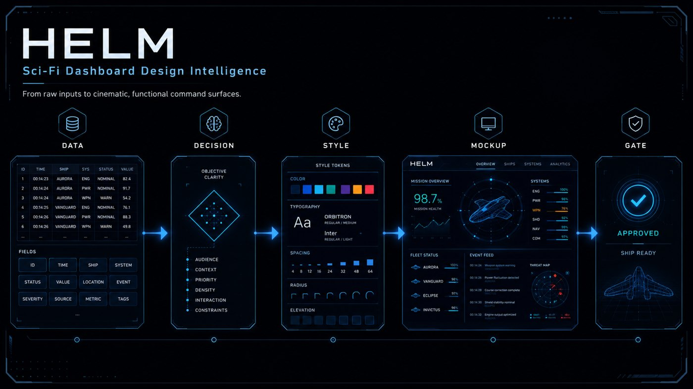
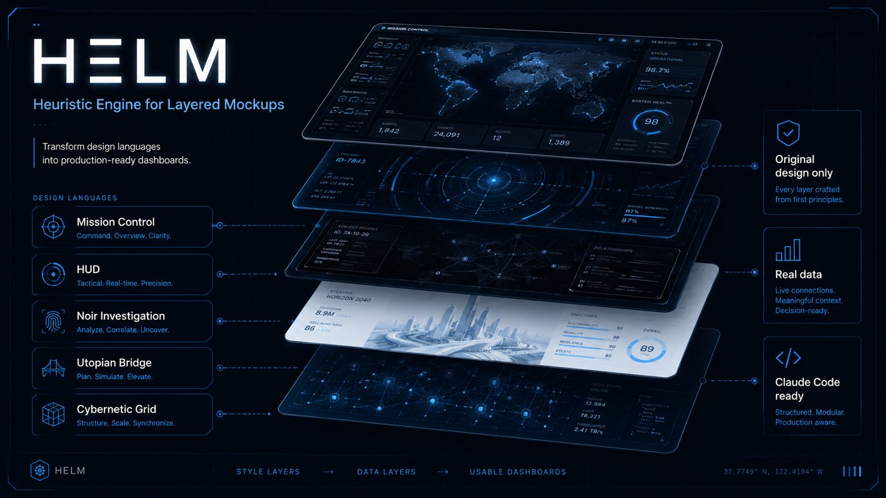
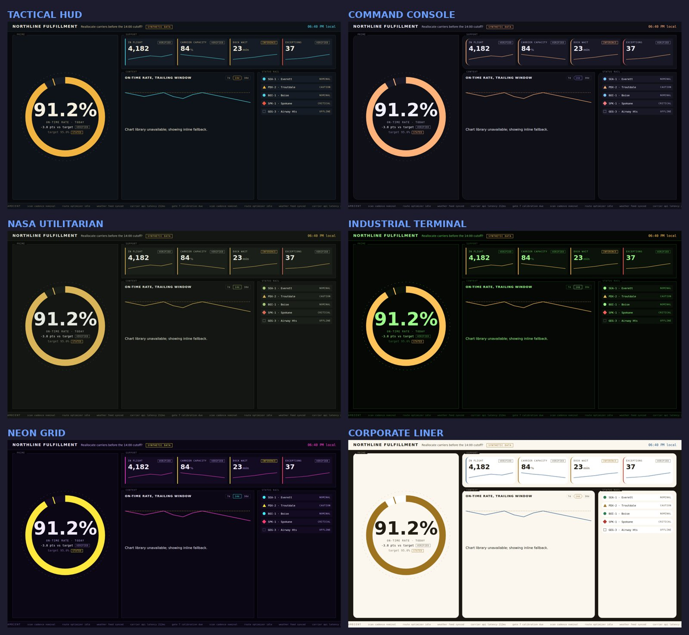
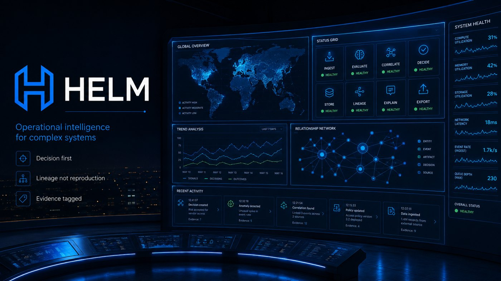
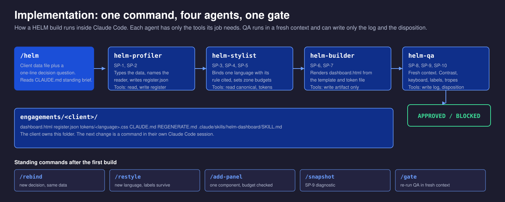
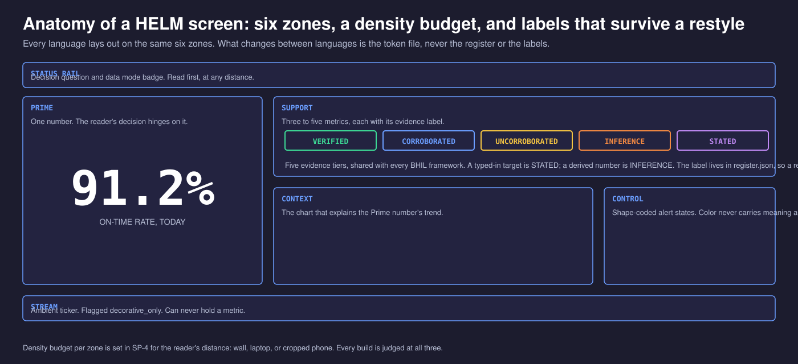
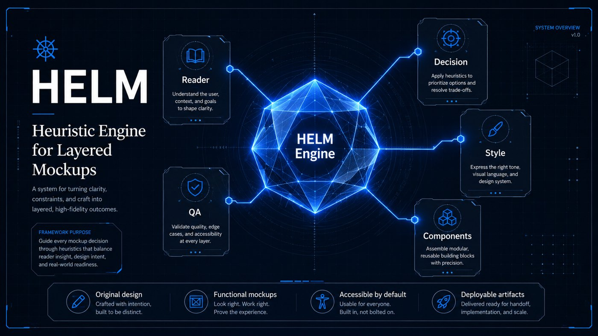

# About HELM

**HELM** stands for **Heuristic Engine for Layered Mockups**. It is a Barry Hurd Intelligence Lab framework for turning a client's data into an interactive dashboard that looks like a science-fiction command surface, reads at room distance, answers one named decision, and can be rebuilt by the client's own Claude Code session without the lab in the loop.

The name is literal. A helm is the station where the information converges and the decision gets made. The engine is heuristic because the fifteen style languages, twelve tropes, and eleven matching rules are judgments distilled from a body of film and game interface work, not a formula. The mockups are layered because every build stacks the same way: canonical data, a style language, a component contract, a functional artifact, a QA gate.

## Why science fiction

Fictional user interfaces are the most effective communication design under time compression ever made. A film screen has roughly one second to read as both complex and clear, and the studios that make them (Territory, Cantina Creative, Imaginary Forces, MK12, SPOV, BLIND, Perception, among others) have spent decades refining that grammar.

The same grammar makes real products worse when copied without editing. Screens that flash, spin, and stream ambient data are anti-usable in a room where someone has to act. HELM keeps the discipline of the one-second read and strips the twelve tropes that cost real users their attention. That trade is the whole framework.

## What HELM produces

A HELM engagement ends with a folder the client owns:

- One self-contained `dashboard.html` that opens from disk, degrades to inline SVG if its one pinned chart library is blocked, honors reduced-motion, and shape-codes every alert state so color is never the only signal.
- A `register.json` that names the reader, the setting, the seconds available, the decision question, and the data mode (live or SYNTHETIC, badged on screen).
- A CSS token file for the chosen language, generated from canonical data so it cannot drift by hand.
- A `CLAUDE.md`, a `REGENERATE.md`, and a client skill file, so the next change is a command in the client's own Claude Code session rather than a ticket back to the lab.

Every metric on screen carries an evidence label from the five-tier vocabulary shared across all BHIL frameworks: VERIFIED, CORROBORATED, UNCORROBORATED, INFERENCE, STATED. A target the client typed in is STATED. A number the engine derived is INFERENCE. The label stays attached through every restyle.

## Who uses it, and for what

HELM is aimed at three buyers.

**Operations leaders with a wall.** A fulfillment center, a network operations room, a clinical quality team, a security desk. They have a number they check ten times a day and a decision that hangs on it. The starter build is this case: on-time rate against a carrier reallocation cutoff, read from across a room.

**Founders and product teams pitching a system.** The data is early, often partly synthetic, and the goal is to make a complex product legible in the one second a slide gets. HELM badges SYNTHETIC on screen so the pitch never quietly becomes a claim.

**Agencies and consultancies who ship dashboards for clients.** They need a repeatable way to produce something distinctive without reinventing a design system per engagement, and they need the client to be able to maintain it afterward. The regenerable folder and the client skill file are built for the handoff.

The eleven matching rules above take the shape of the data and the reader's situation and bind one language. A status grid across many systems binds Command-Console; a single live number binds Tactical HUD; logs bind Industrial Terminal; a public-facing wayfinding screen binds Corporate-Liner. The alternate is there for when the setting argues against the first fit: a sales demo of a NASA-Utilitarian screen may want Command-Console's warmth instead.

## How the pipeline runs

Ten prompts, run in order, each with a gate.

| Stage | Prompts | What has to be true before the next stage |
|---|---|---|
| Profile | SP-1, SP-2 | The data is typed, the reader is named, the decision question is one sentence |
| Map | SP-3, SP-4 | One language is bound with its rule cited; the six zones have a density budget |
| Style | SP-5 | Every component has states, props, and an accessibility contract |
| Build | SP-6, SP-7 | The artifact runs from disk; motion has a purpose and a reduced-motion path |
| Ship | SP-8, SP-9, SP-10 | Contrast, keyboard, and screen-reader checks pass; the snapshot is written; a fresh-context QA agent signs off |

In Claude Code the same stages are four CADRE agents (`helm-profiler`, `helm-stylist`, `helm-builder`, `helm-qa`) with tool grants that match their job. The QA agent can only write the log and the disposition. It always runs in a fresh context so it is judging the artifact, not the conversation that produced it.

## The fifteen languages

The catalog holds fifteen style languages, each with an original token set, open-license typefaces, a native use, a hierarchy pattern, a motion pattern, and a known cost. Command-Console for calm multi-system monitoring. Tactical HUD when one number matters. Industrial Terminal for logs and audits. NASA-Utilitarian for engineering audiences who distrust spectacle. Corporate-Liner for public wayfinding. Neon-Grid for the moments that are allowed to be loud. The full table is on the [catalog overview](catalog/index.md).

Three languages (Monochrome-Blueprint, Diegetic Wearable, Retro-Forward) are never selected by the matching rules. They require an explicit override, because their costs are high enough that a client should choose them on purpose.

The language names on the panel above are illustrative composites drawn for the launch imagery; the canonical names are the fifteen in the catalog.

## One register, any language

The same `register.json` and the same synthetic data, rendered six times by swapping one token file. Nothing else changes. (Rendered offline, so the inline chart fallback is showing in the Context zone.) The SYNTHETIC badge, the STATED label on the target, the INFERENCE label on dock wait, and the shape-coded status rail are all present in all six because they live in the register, not in the stylesheet. This is what `/restyle` does in a client's Claude Code session, and it is the practical meaning of "labels survive a restyle."

## The operating room

HELM is designed for the wall, the laptop, and the cropped phone view at the same time. Every build is judged at all three distances. The three commitments on the left of that image are the framework in six words: decision first, lineage not reproduction, evidence tagged.

## Implementation

A build starts with `/helm` and a data file. The four CADRE agents run the ten prompts in order, each holding only the tools its stage needs. The profiler can write the register and nothing else. The builder can write the artifact and nothing else. The QA agent runs in a fresh context so it cannot be talked into approving what the conversation already believes is fine, and it can write only the log and the disposition.

What comes out is a folder the client owns. From then on, the standing commands cover the common changes: `/rebind` for a new decision on the same data, `/restyle` for a new language, `/add-panel` to add one component against the zone's density budget, `/snapshot` for the SP-9 diagnostic, and `/gate` to re-run QA.

Every language lays out on the same six zones with a density budget set for the reader's distance. The Prime zone holds the one number. Support holds three to five metrics, each with its evidence label. Context holds the chart that explains the trend. Control holds the alert states, shape-coded so color never carries meaning alone. The Status Rail carries the decision question and the data-mode badge. The Stream is the ambient ticker, flagged decorative and forbidden from holding a metric.

Outside Claude Code, the same pipeline runs from the prompts directly in any Claude session, and the validators, drift gate, and tests run from a shell with stdlib Python.

## What HELM refuses to do

- **Reproduce a franchise interface.** The lineage register records which studios and productions each language descends from, and the tests fail the build if a property name enters a shipped file. Clients get the family resemblance, never the copy.
- **Ship decoration as data.** The Ambient Ticker component exists, is flagged `decorative_only`, and can never carry a metric.
- **Let a restyle strip a label.** Evidence tiers and the SYNTHETIC badge survive every language change because they live in the register, not the template.

## The research behind it

The catalog was distilled from a study board of 43 sourced visuals across 47 named productions and interfaces, each traced to a studio portfolio, designer interview, specialist archive, or film still, in that order of preference. The board ships in `research/reference-pack/` as a 26-page PDF, a self-contained HTML page, the image set, and the two ledgers that generate them. See the [reference pack](research/reference-pack.md) page for the coverage table and the rights posture.

The machine-readable distillation is `data/canonical/lineage_register.json`. It is the only file in the canonical layer where production names appear, and every attribution in it carries an evidence tier.

## The engine, in one picture

Reader, decision, style, components, QA. Everything else in the repository is tooling to keep those five honest: schemas with count laws, a drift gate that fails on hand edits, contrast floors checked in CI, an em-dash sweep on derived prose, and twenty-one regression tests that each name the bug they prevent.

## Disclaimer

All film, television, and game titles, studio and designer names, and the images collected in the reference pack are the property of their respective license holders. They appear here for design study, commentary, and lineage attribution only; no affiliation or endorsement is claimed. This repository exists solely for development, research, and innovation use and grants no right to reproduce or exploit any third-party work. The full text is in [DISCLAIMER.md](https://github.com/PolymathWizard/BHIL-HELM-Sci-Fi-Visualizer/blob/main/DISCLAIMER.md).

## Provenance and licensing

Code, schemas, and tooling are MIT. Content, prompts, and catalog text are CC BY 4.0. The five hero panels were generated for the launch and are BHIL originals. The reference pack images are third-party study material and are not covered by either license; see the pack README.

HELM is part of the BHIL framework family, alongside CADRE (the agent pattern it runs on), QUADRA, CIPHER, PRIMER, LOCUS, and FACET (which shares its evidence-tier vocabulary). Version history is in the [changelog](https://github.com/PolymathWizard/BHIL-HELM-Sci-Fi-Visualizer/blob/main/CHANGELOG.md).

## Who built it

Barry Hurd, Barry Hurd Intelligence Lab. GitHub: [PolymathWizard](https://github.com/PolymathWizard). Built with Claude as the build partner, human-directed at every gate.

*Human-Directed. AI-Enabled. Commercially Tested.*
