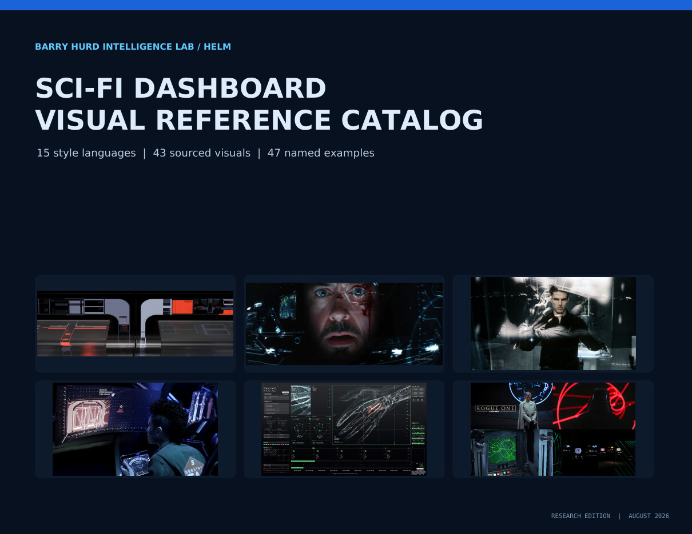

# Visual reference pack



The study board the HELM catalog was distilled from. It lives in `research/reference-pack/` and is not read by any validator or copied into any deliverable. Fifteen languages, 43 sourced visuals, 47 named examples, every image traced to a source page in a fixed order of preference: studio or designer portfolio, named designer interview, specialist archive, then film still.

Open the catalog: [PDF](https://github.com/PolymathWizard/BHIL-HELM-Sci-Fi-Visualizer/blob/main/research/reference-pack/HELM_SciFi_Dashboard_Visual_Catalog.pdf) (26 pages, 133 clickable links) or [self-contained HTML](https://github.com/PolymathWizard/BHIL-HELM-Sci-Fi-Visualizer/blob/main/research/reference-pack/HELM_SciFi_Dashboard_Visual_Catalog.html).

## Style map

| # | Language | Native use | Primary visual device | Main risk |
|---|---|---|---|---|
| 1 | Command-Console | Calm monitoring across many systems | Rounded elbow frames, sweeping bars, grouped zones | Too many colors or narrow labels at distance |
| 2 | Tactical HUD | Live telemetry with one critical number | Reticles, radar arcs, gyroscopic rings | Decoration can bury the central reading |
| 3 | Industrial Terminal | Logs, events, audits, text-heavy status | Text tables, boxed readouts, cursor, pictograms | Weak chart language and an impersonal tone |
| 4 | Vector-Wireframe | Sparse geometry, trajectory, archival time series | Converging lines, wireframes, reticles, countdown | Poor magnitude encoding when fills are absent |
| 5 | Gestural Holographic | Investigation, drill-down, relationship work | Floating panes, object-like video, depth stacking | Transparent-screen glare and arm fatigue |
| 6 | Hard-Realism Tactical | Multi-unit operations and plausible enterprise use | Faction color grammar and clear system zones | Can look generic without a strong faction grammar |
| 7 | NASA-Utilitarian | Engineering, mission status, precision audiences | Telemetry cells, orbital diagrams, dense grids | Low spectacle can feel flat in sales settings |
| 8 | Sonar-Surveillance | Security, anomaly, network, threat monitoring | Point clouds, wireframe space, scan fields | The visual language carries an ethical surveillance mood |
| 9 | Neuro-Medical | Clinical, anatomical, regulated, QA data | Volumetric regions, orthographic panels, isolated anatomy | Cold tone and limited brand personality |
| 10 | Corporate-Liner | Public information, wayfinding, onboarding | Concierge cards, cutaways, large friendly numbers | Over-simplification can make expert data feel childish |
| 11 | Tabletop-Motion | Joint review, evidence rooms, deal rooms | Cards as physical objects with cross-reference lines | Motion can slow readers who need fast scanning |
| 12 | Neon-Grid | Entertainment, gaming, nightlife, high-energy moments | Glowing grids, circuit traces, ribbon paths | Glow cuts contrast and causes fatigue |
| 13 | Monochrome-Blueprint | Engineering, facilities, restraint-first brands | Blueprint linework and symbol-only controls | Symbol-only controls demand training |
| 14 | Diegetic Wearable | Wearables, mobile status, in-place feedback | Body status strip, projected panels, locator trail | Three-dimensional maps are weak navigation tools |
| 15 | Retro-Forward | Heritage, museums, archives, long time horizons | Analog vector lines, blueprints, physical switches | Low resolution limits density and accessibility |

## Coverage ledger

Every production or interface named in the four HELM source files. 25 of 47 have a retained visual. Production names appear here and in `data/canonical/lineage_register.json` only; they never enter tokens, templates, prompts, or client artifacts.

| Example | Year | Closest language | Visual | Note |
|---|---|---|---|---|
| LCARS / Star Trek: The Next Generation | 1987 | Command-Console | Yes | Modern portfolio study under the Star Trek design lineage |
| Stark HUD and J.A.R.V.I.S. / Iron Man | 2008 | Tactical HUD | Yes | First-party studio portfolio |
| MOTHER / MU-TH-UR 6000 / Alien | 1979 | Industrial Terminal | Yes | Strong specialist study with Ron Cobb material |
| Vector HUDs and targeting computers / Star Wars | 1977 | Vector-Wireframe | Yes | Modern studio-work archive plus original-film still |
| ESPER / Blade Runner | 1982 | Retro-Forward | Partial | Scene still and real-world critique; no designer portfolio found |
| Gestural Pre-Crime interface / Minority Report | 2002 | Gestural Holographic | Yes | First-party studio portfolio |
| HAL 9000 displays / 2001: A Space Odyssey | 1968 | NASA-Utilitarian | Yes | Film-still archive |
| Dead Space diegetic HUD | 2008 | Diegetic Wearable | Yes | Lead UI designer GDC session plus stills |
| The Expanse ship and civic interfaces | 2015-2022 | Hard-Realism Tactical | Yes | Designer interview and image archive |
| TRON computer world | 1982 | Neon-Grid | Yes | Film-still archive |
| Terminator / T2 machine vision | 1984-1991 | Tactical HUD | No | Confirmed in source thread; better rights-cleared still still needed |
| The Island Merrick desk | 2005 | Tabletop-Motion | Yes | Designer explanation and large interface still |
| Matrix Reloaded Zion control room | 2003 | Monochrome-Blueprint | Yes | Specialist archive |
| Ghost in the Shell: Stand Alone Complex | 2002-2005 | Gestural Holographic | No | Confirmed in source thread; no production portfolio retained |
| The Animatrix robot point of view | 2003 | Tactical HUD | No | Thread example only |
| X-Men 3D map | 2000-2006 | Gestural Holographic | No | Thread example only |
| KITT / Knight Rider | 1982-1986 | Command-Console | No | Voice-agent example; no visual retained |
| Avatar human and Na'vi interfaces | 2009 | Gestural Holographic | No | Confirmed in source thread |
| District 9 mech HUD and alien navigation | 2009 | Diegetic Wearable | No | Strong written entry; no stable large image retained |
| Final Fantasy: The Spirits Within wrist computer | 2001 | Diegetic Wearable | No | Thread example only |
| Stranger Than Fiction screen typography | 2006 | Tabletop-Motion | No | MK12 motion reference; interface is mostly non-diegetic |
| Andromeda Ascendant AI | 2000-2005 | Command-Console | No | Agent-as-character example |
| The Hitchhiker's Guide device | 1978 onward | Corporate-Liner | No | Handheld reference-device lineage |
| 24 mail and operations UI | 2001-2010 | Hard-Realism Tactical | No | Useful anti-pattern; no visual retained |
| Gamer full-body control room | 2009 | Gestural Holographic | No | Thread example only |
| World Builder holographic authoring tools | 2007 | Gestural Holographic | No | Short-film reference; public video remains the best source |
| TRON: Legacy | 2010 | Neon-Grid | No | Modern extension of TRON language |
| Swordfish hacking UI | 2001 | Industrial Terminal | No | Stylized hacker-interface anti-pattern |
| Quantum of Solace MI6 table and wall | 2008 | Tabletop-Motion | Yes | MK12 work archive |
| WALL-E Axiom displays | 2008 | Corporate-Liner | Yes | Multi-image specialist critique |
| The Andromeda Strain Wildfire displays | 1971 | Industrial Terminal | Yes | Strong still for interface-as-narrator |
| Red Dwarf Holly | 1988 onward | Command-Console | No | Anthropomorphic interface example |
| Firefox thought-controlled weapons | 1982 | Diegetic Wearable | No | Invisible-interface edge case |
| Justice League Cyborg and Batcave UI | 2017 | Tactical HUD | Yes | Designer portfolio and BLIND credit |
| The Dark Knight sonar surveillance | 2008 | Sonar-Surveillance | Yes | Strong design-fiction analysis plus still |
| The Dark Knight Rises reactor UI | 2012 | NASA-Utilitarian | No | Designer portfolio found; visual not retained |
| The Fifth Estate WikiLeaks UI | 2013 | Industrial Terminal | No | List source; portfolio page unavailable |
| Doom UAC facility and BFG UI | 2005 | Industrial Terminal | No | List source; BLIND social trace only |
| Rogue One screen graphics | 2016 | Retro-Forward | Yes | Large montage plus film still |
| Mute future-Berlin graphics | 2018 | Neon-Grid | Yes | Designer portfolio |
| Doctor Strange medical UI | 2016 | Neuro-Medical | Yes | SPOV case study with large images |
| Mission: Impossible - Rogue Nation Torus UI | 2015 | Sonar-Surveillance | Yes | First-party studio portfolio |
| Life ISS graphics | 2017 | NASA-Utilitarian | Yes | Designer interview with large images |
| Interstellar Endurance and TARS screens | 2014 | NASA-Utilitarian | Yes | Designer portfolio with live-playback account |
| Passengers Avalon interfaces | 2016 | Corporate-Liner | Yes | Designer portfolio with eight large images |
| The Cabin in the Woods facility control room | 2012 | Hard-Realism Tactical | Yes | Production-artist portfolio plus control-room image |
| Independence Day: Resurgence Area 51 UI | 2016 | Hard-Realism Tactical | Yes | Designer portfolio and Twisted Media credit |

## Rights

The images are study references. Rights remain with the credited studios, artists, publishers, and film or game owners. Use the pack for internal research, mood boards, and design briefs. Ask the owner before any public redistribution beyond that use. No image from the pack may appear in a client deliverable; a HELM build reads as the same family as its lineage without reproducing any element of it.

## Rebuilding the catalog

```bash
cd research/reference-pack
python3 build_catalog.py
```

`assets.tsv` carries the direct image URL for every entry, so the image set can be re-fetched if the tree is ever published without it.
