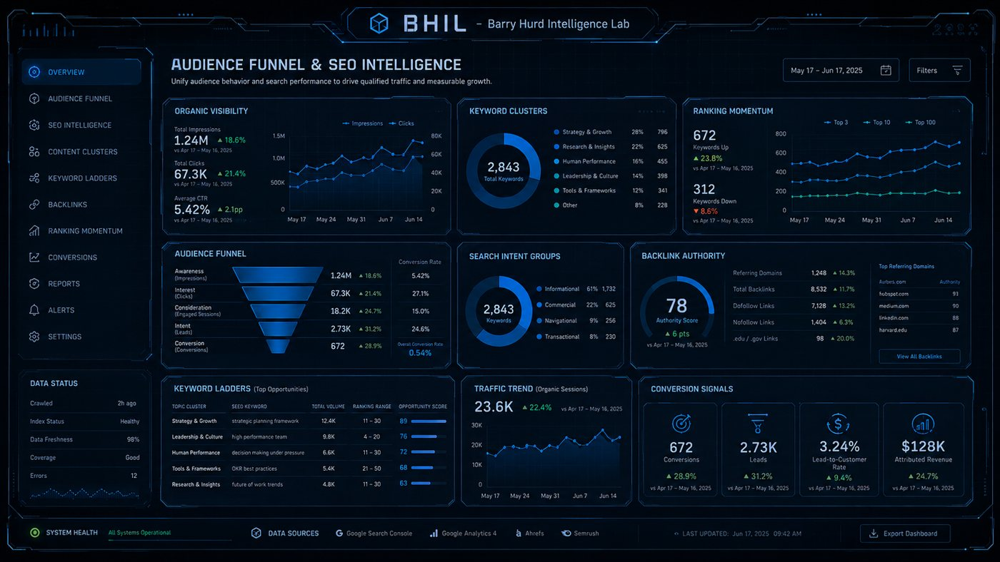
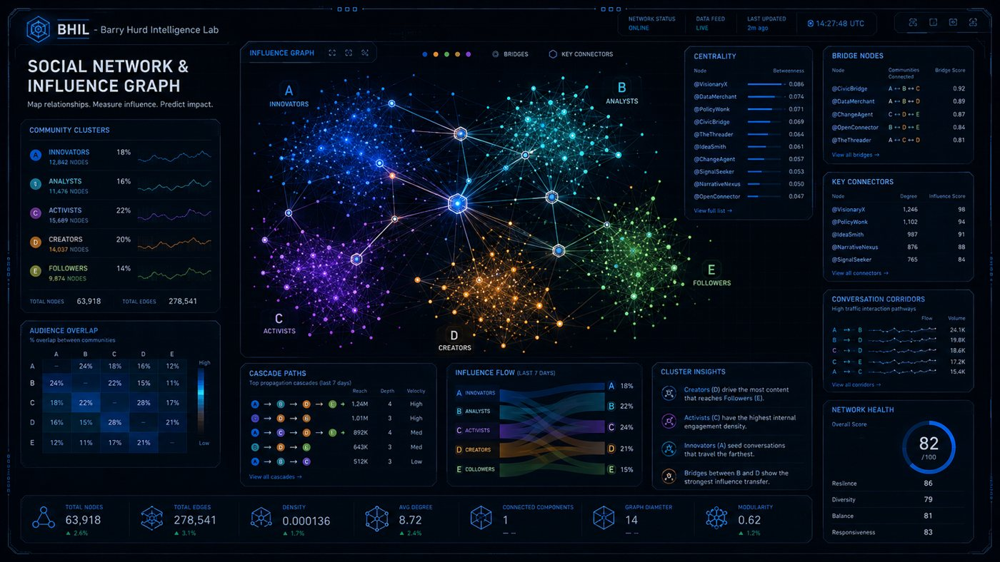
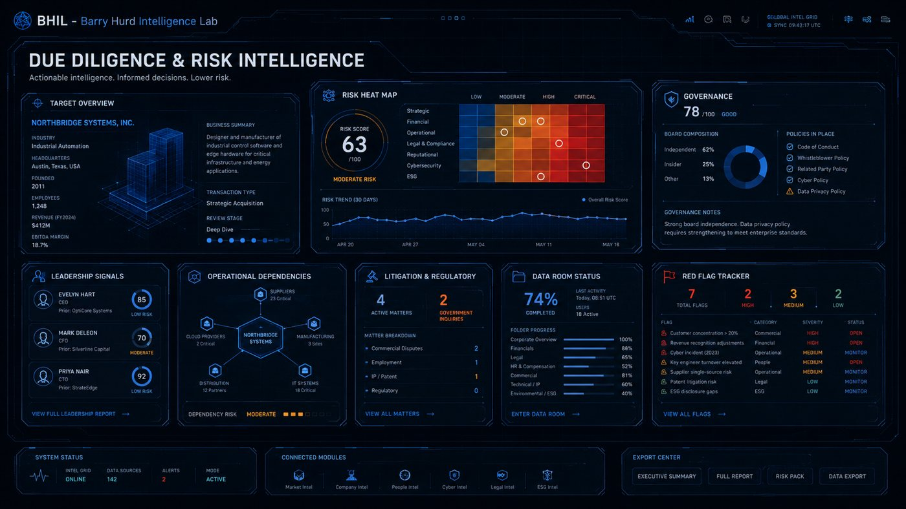
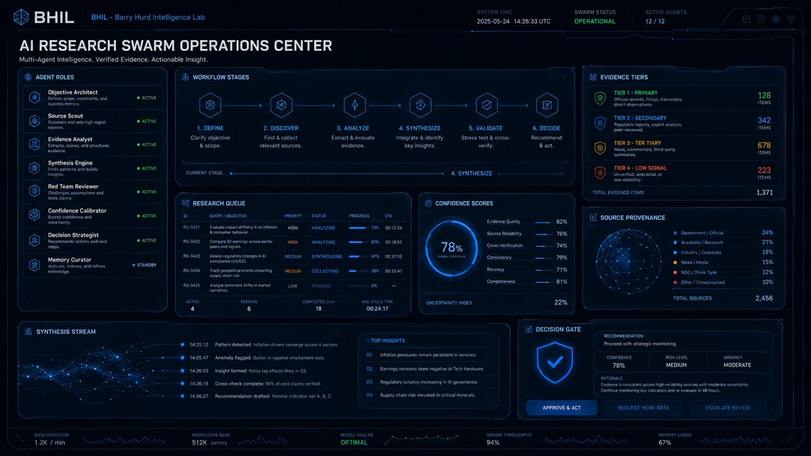
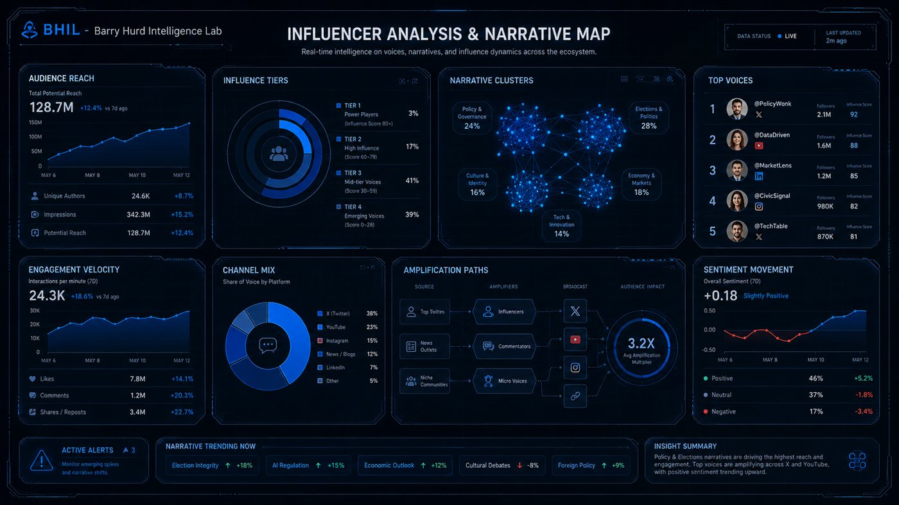
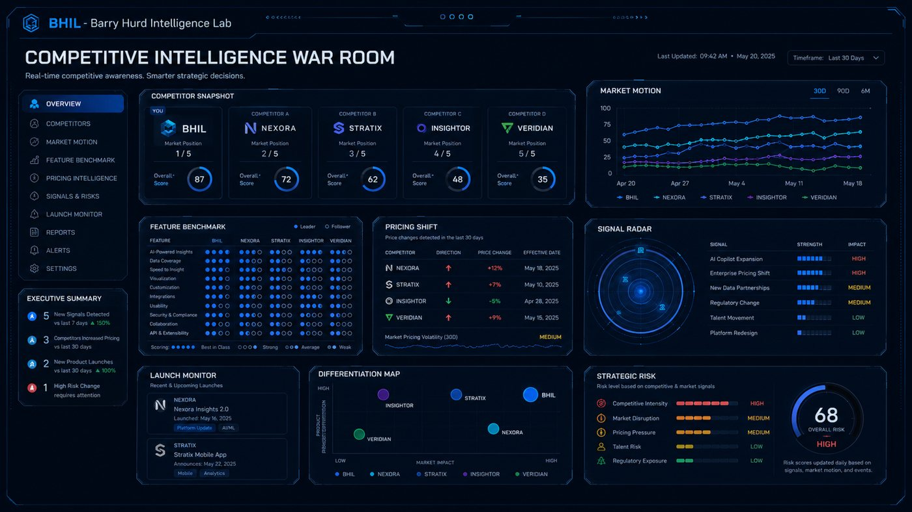
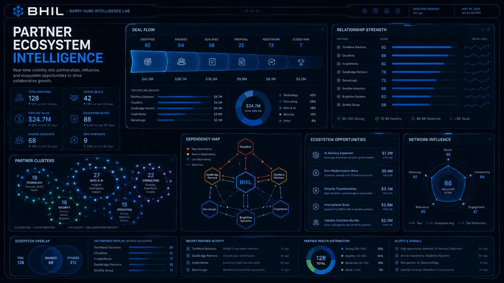
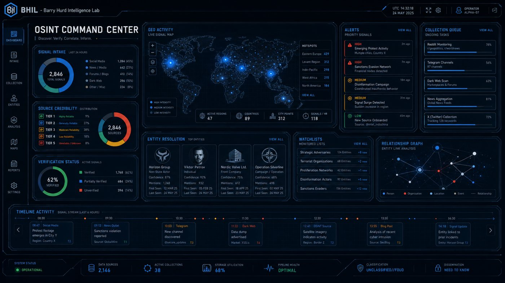
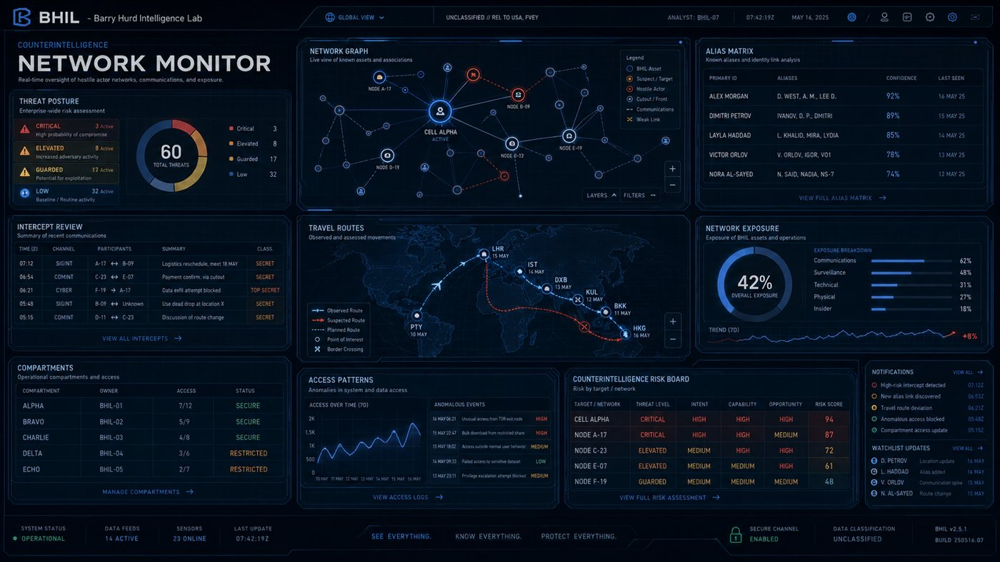
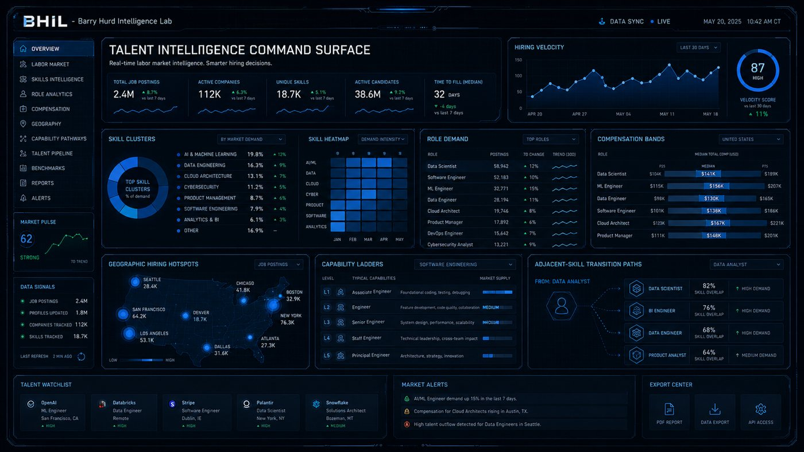

# Sample dashboard library

These ten panels are BHIL concept renders: launch imagery that shows the target fidelity HELM aims at, not builds produced by the pipeline. Each is annotated with the data shape it represents, the matching rule that would fire, and the decision question a HELM build of it would have to answer. Any brand marks, platform names, and faces inside the renders are illustrative placeholders.

<table>
<tr><td width="50%" valign="top"> <b>Audience Funnel and SEO Intelligence</b> Unify audience behavior and search performance into one growth read. Data shape: <code>status-grid</code> · Rule M01 binds <code>command-console</code> Decision: Which content cluster gets the next month of effort?</td><td width="50%" valign="top"> <b>Social Network and Influence Graph</b> Map communities, bridges, and cascade paths across a 64K-node network. Data shape: <code>relationship-graph</code> · Rule M04 binds <code>gestural-holographic</code> Decision: Which bridge nodes move a narrative between communities?</td></tr>
<tr><td width="50%" valign="top"> <b>Due Diligence and Risk Intelligence</b> Target overview, risk heat map, governance, red flags, data-room progress. Data shape: <code>evidence-board</code> · Rule M10 binds <code>tabletop-motion</code> Decision: Does the deal proceed to the next review stage?</td><td width="50%" valign="top"> <b>AI Research Swarm Operations Center</b> Agent roles, workflow stage, evidence tiers, confidence, and a decision gate. Data shape: <code>status-grid</code> · Rule M01 binds <code>command-console</code> Decision: Approve, request more data, or escalate the recommendation?</td></tr>
<tr><td width="50%" valign="top"> <b>Influencer Analysis and Narrative Map</b> Reach, influence tiers, narrative clusters, amplification paths, sentiment. Data shape: <code>relationship-graph</code> · Rule M04 binds <code>gestural-holographic</code> Decision: Which narrative is accelerating and who is amplifying it?</td><td width="50%" valign="top"> <b>Competitive Intelligence War Room</b> Competitor snapshot, market motion, feature benchmark, pricing shift, signal radar. Data shape: <code>multi-unit</code> · Rule M06 binds <code>hard-realism-tactical</code> Decision: Which competitor move requires a response this week?</td></tr>
<tr><td width="50%" valign="top"> <b>Partner Ecosystem Intelligence</b> Deal flow, relationship strength, dependency map, ecosystem opportunities. Data shape: <code>evidence-board</code> · Rule M10 binds <code>tabletop-motion</code> Decision: Which partnership opportunity gets pursued this quarter?</td><td width="50%" valign="top"> <b>OSINT Command Center</b> Signal intake, source credibility, geo activity, entity resolution, timeline. Data shape: <code>threat-network</code> · Rule M05 binds <code>sonar-surveillance</code> Decision: Which priority signal needs analyst attention now?</td></tr>
<tr><td width="50%" valign="top"> <b>Counterintelligence Network Monitor</b> Threat posture, network graph, alias matrix, travel routes, exposure. Data shape: <code>threat-network</code> · Rule M05 binds <code>sonar-surveillance</code> Decision: Which target network carries the highest risk score today?</td><td width="50%" valign="top"> <b>Talent Intelligence Command Surface</b> Hiring velocity, skill clusters, role demand, compensation bands, geography. Data shape: <code>status-grid</code> · Rule M01 binds <code>command-console</code> Decision: Where is the labor market moving against the hiring plan?</td></tr>
</table>

## Full-resolution files

| File | Title |
|---|---|
| `assets/samples/BHIL-sample-dashboard-01-audience-funnel-seo.png` | Audience Funnel and SEO Intelligence |
| `assets/samples/BHIL-sample-dashboard-02-social-network-influence-graph.png` | Social Network and Influence Graph |
| `assets/samples/BHIL-sample-dashboard-03-due-diligence-risk.png` | Due Diligence and Risk Intelligence |
| `assets/samples/BHIL-sample-dashboard-04-ai-research-swarm-operations.png` | AI Research Swarm Operations Center |
| `assets/samples/BHIL-sample-dashboard-05-influencer-narrative-map.png` | Influencer Analysis and Narrative Map |
| `assets/samples/BHIL-sample-dashboard-06-competitive-intelligence-war-room.png` | Competitive Intelligence War Room |
| `assets/samples/BHIL-sample-dashboard-07-partner-ecosystem-intelligence.png` | Partner Ecosystem Intelligence |
| `assets/samples/BHIL-sample-dashboard-08-osint-command-center.png` | OSINT Command Center |
| `assets/samples/BHIL-sample-dashboard-09-counterintelligence-network-monitor.png` | Counterintelligence Network Monitor |
| `assets/samples/BHIL-sample-dashboard-10-talent-intelligence-command-surface.png` | Talent Intelligence Command Surface |
